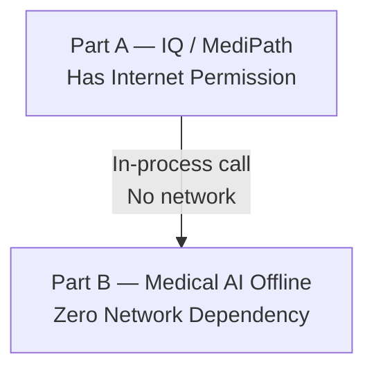
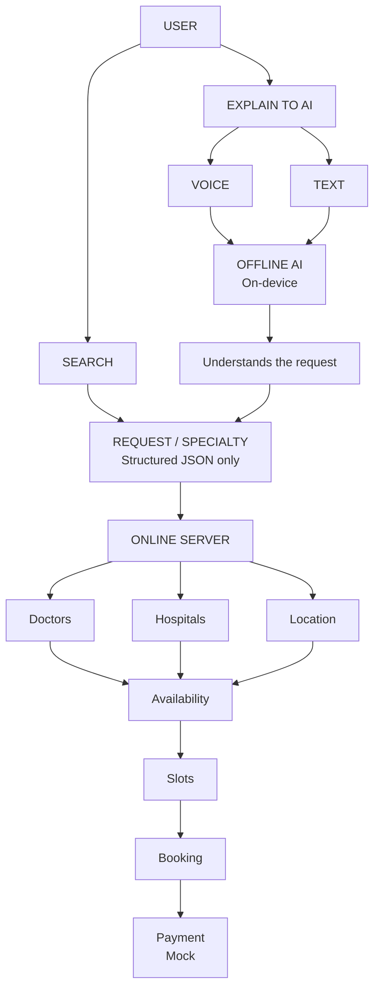
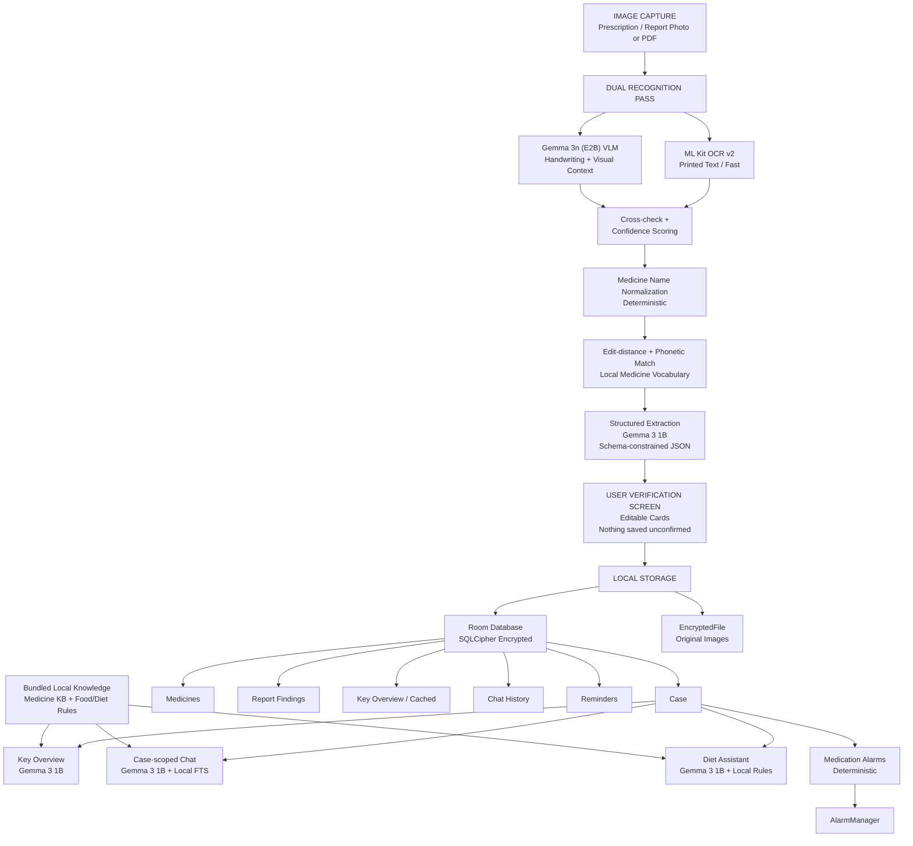
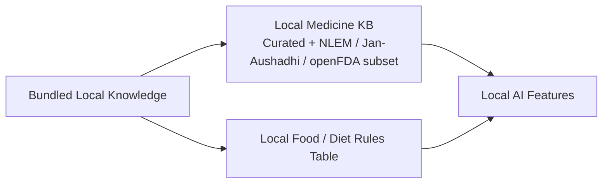

# MediPath

MediPath is a repository containing two connected but independently runnable application parts:

* **Part A — IQ / MediPath:** Doctor discovery, AI-assisted search, availability, booking and payment prototype.
* **Part B — Medical AI Offline:** A local health case assistant that performs AI inference, medical-data processing, retrieval and storage entirely on-device.

---

## Architecture Overview

The repository separates the online doctor-discovery workflow from the offline medical-assistance workflow.



**Important:** Part B is designed to operate without cloud AI APIs or network access. Its AI models, databases, retrieval systems and knowledge sources are local.

---

# Part A — IQ / MediPath

IQ / MediPath provides the user-facing doctor discovery and booking workflow.



### Flow

1. The user searches directly or explains their requirement using text or voice.
2. The on-device AI interprets the request.
3. The AI produces a structured request/specialty representation.
4. The request is sent to the online server.
5. Doctor, hospital and location information are used for discovery.
6. Available slots are presented.
7. The booking flow proceeds to a mock payment step.

---

# Part B — Medical AI Offline

Medical AI Offline is designed as a **fully local health case assistant**.

All core AI inference and data processing in Part B are intended to run locally on the device.



## Medical AI Processing Flow

### 1. Image Capture

The user provides a prescription or medical report as:

* Photo
* Captured image
* PDF

### 2. Dual Recognition Pass

Two local recognition paths process the input:

**ML Kit OCR v2**

* Optimized for printed text.
* Runs on-device.

**Gemma 3n (E2B) VLM**

* Handles handwriting and visual context.
* Runs locally.

The outputs are cross-checked and confidence-scored.

### 3. Medicine Name Normalization

Medicine names are normalized deterministically using:

* Edit-distance matching
* Phonetic matching
* Local medicine vocabulary

Example:

```text
Cetrizn 10
      ↓
Cetirizine 10 mg
```

The normalized result retains a confidence level.

### 4. Structured Extraction

**Gemma 3 1B** converts the recognized medical information into schema-constrained structured JSON.

The extracted information includes:

* `medicines[]`
* `reportFindings[]`
* Original OCR spans
* Confidence information

### 5. User Verification

Extracted information is shown to the user through editable cards.

**Nothing is saved as confirmed medical information until the user verifies it.**

### 6. Local Storage

Verified case information is stored locally using:

* **Room Database**
* **SQLCipher encryption**
* **EncryptedFile** for original images

The case can contain:

```text
Case
├── Medicines
├── Report Findings
├── Key Overview
├── Chat History
└── Reminders
```

---

# Local AI Features

## Key Overview

Uses **Gemma 3 1B** with a retrieve-then-explain workflow.

The generated overview can be cached locally for the case.

---

## Case-scoped Chat

Uses:

* Gemma 3 1B
* Local case retrieval
* Room FTS retrieval

The chat is scoped to the user's medical case rather than being an unrestricted general-purpose assistant.

---

## Diet Assistant

Uses:

* Gemma 3 1B
* Local food/medicine rules table

The assistant uses the bundled local rules as part of the grounding information.

---

## Medication Alarms

Medication reminders are deterministic and do not require an AI model.

They use:

```text
Medication Schedule
       ↓
AlarmManager
       ↓
Local Reminder
```

---

# Grounding Sources

Medical AI Offline uses bundled local knowledge sources.



These sources are bundled/read-only resources used locally by the application.

The Medical AI Offline workflow does not depend on querying an online medical knowledge service at runtime.

---

# Offline-First Design

Part B is intentionally designed around local execution.

```text
┌─────────────────────────────────────────────┐
│           MEDICAL AI OFFLINE                │
│                                             │
│  AI Models             Local                 │
│  OCR                   Local                 │
│  LLM                   Local                 │
│  VLM                   Local                 │
│  Medical KB            Local                 │
│  Food/Diet Rules       Local                 │
│  Database              Local + Encrypted     │
│  Images                Local + Encrypted     │
│  Retrieval             Local                 │
│  Chat                  Local                 │
│  Reminders             Local                 │
│                                             │
│          NO CLOUD AI REQUIRED               │
└─────────────────────────────────────────────┘
```

The key design principle is:

> **Medical data stays on the device and AI inference is performed locally.**

---

# Running the Applications

## Prerequisites

Install:

* Git
* Node.js
* Python 3.11+
* Modern web browser

---

# 1. Clone the Repository

```bash
git clone https://github.com/lokeshmudunuri/medi-path.git
cd medi-path
```

---

# 2. Run IQ / MediPath

From the repository root:

```bash
npm install
npm run dev
```

Vite will display the local development URL.

Normally:

```text
http://localhost:5173
```

Open that URL in your browser.

---

# 3. Run Medical AI Offline

Keep the IQ terminal running if you want to test both applications.

Open a **new terminal**:

```bash
cd medi-path/medical-ai-offline
```

Create the Python virtual environment:

```bash
python -m venv .venv
```

Activate it on Windows:

```powershell
.venv\Scripts\activate
```

Install the development dependencies:

```bash
pip install -r requirements-dev.txt
```

Start the application:

```bash
python run.py --port 8000
```

Open:

```text
http://127.0.0.1:8000
```

---

# Evaluation Flow

## IQ / MediPath

```text
Clone repository
      ↓
npm install
      ↓
npm run dev
      ↓
Open localhost:5173
      ↓
Explore doctor discovery
      ↓
Try AI-assisted search
      ↓
Explore availability / booking
```

## Medical AI Offline

```text
Clone repository
      ↓
cd medical-ai-offline
      ↓
Create Python virtual environment
      ↓
pip install -r requirements-dev.txt
      ↓
python run.py --port 8000
      ↓
Open 127.0.0.1:8000
      ↓
Scan prescription / report
      ↓
Verify extracted information
      ↓
Create local case
      ↓
Explore medical overview / chat / diet / reminders
```

---

# Repository Structure

```text
medi-path/
│
├── src/
│   ├── components/
│   ├── pages/
│   ├── services/
│   └── ...
│
├── medical-ai-offline/
│   ├── app/
│   ├── frontend/
│   ├── models/
│   ├── tests/
│   ├── requirements.txt
│   ├── requirements-dev.txt
│   ├── requirements-ai.txt
│   ├── DEVELOPMENT.md
│   ├── ARCHITECTURE.md
│   └── run.py
│
├── package.json
├── vite.config.ts
└── README.md
```

---

# Medical AI Offline — Design Principles

### Local AI

The Medical AI workflow uses local AI models rather than cloud inference.

### Local Storage

Medical cases, chat history and original images are stored locally with encryption.

### User Verification

Extracted medical information is presented for user verification before being saved as confirmed case data.

### Deterministic Processing

Medicine normalization and medication reminders use deterministic processing where an AI model is not required.

### Grounded Responses

Medical AI features use the local case data and bundled local knowledge sources as grounding context.

### No Runtime Cloud Dependency

The Medical AI Offline component is designed to function without depending on a cloud AI service or online medical knowledge API.

---

# Detailed Documentation

For deeper implementation details, see:

* `medical-ai-offline/README.md`
* `medical-ai-offline/ARCHITECTURE.md`
* `medical-ai-offline/DEVELOPMENT.md`
* `medical-ai-offline/MODELS.md`

---

## Important Separation

The repository contains two different execution models:

```text
                 MEDIPATH
                    │
          ┌─────────┴─────────┐
          │                   │
          ▼                   ▼
      PART A                PART B
    IQ / MediPath       Medical AI Offline
          │                   │
          ▼                   ▼
   Online Services       Local AI
   Doctor Discovery      Local OCR
   Availability          Local VLM
   Booking               Local LLM
   Mock Payment          Local Storage
                         Local Retrieval
                         Local Knowledge
                              │
                              ▼
                       No Cloud AI Runtime
```

**Part A** handles online doctor discovery and booking functionality.

**Part B** is the Medical AI Offline component and is designed around local AI inference, local encrypted storage and bundled local knowledge.
